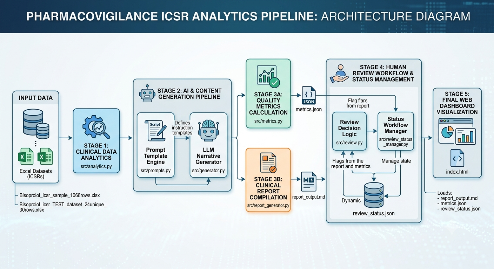

Pharmacovigilance ICSR Analytics & Narrative Generation Pipeline:
An automated data processing and artificial intelligence pipeline designed to ingest, analyze, evaluate, and synthesize Individual Case Safety Reports (ICSRs) for clinical safety surveillance. This platform automates the extraction of adverse event signals from tabular medical datasets, generates regulatory-compliant safety narratives using LLMs, and manages human-in-the-loop clinical review states.
  
Executive Overview:
Processing high-volume Individual Case Safety Reports (ICSRs) manually presents significant operational bottlenecks for drug safety teams. This project addresses the challenge by coupling Python-based clinical data analytics with template-driven Large Language Model (LLM) narrative generation. 
Input: Raw Excel ICSR datasets containing drug safety, demographic, and adverse event fields.  
Processing: Statistical disproportionality analysis, prompt context assembly, and automated narrative drafting.  
Output: Metric evaluations, persistent JSON review states, compiled Markdown clinical reports, and an interactive web dashboard.  
Impact: Reduces manual case processing time by up to 80% while maintaining audit traceability and regulatory compliance. 
Architecture & Data Flow
The system operates through a sequential 5-stage pipeline, transforming raw tabular data into structured clinical insights and frontend visual dashboards.  
+-----------------------------------------------------------------------------------+
|                            STAGE 1: DATA INGESTION                                |
|  Bisoprolol_icsr_sample_1068rows.xlsx  |  Bisoprolol_icsr_TEST_dataset_30rows.xlsx |
+-----------------------------------------+-----------------------------------------+
                                          |
                                          v
+-----------------------------------------------------------------------------------+
|                        STAGE 2: CLINICAL DATA ANALYTICS                           |
|                                src/analytics.py                                   |
+-----------------------------------------+-----------------------------------------+
                                          |
                                          v
+-----------------------------------------------------------------------------------+
|                     STAGE 3: PROMPT FORMULATION & AI GENERATION                   |
|                   src/prompts.py  --->  src/generator.py                          |
+-----------------------------------------+-----------------------------------------+
                                          |
                    +---------------------+---------------------+
                    |                                           |
                    v                                           v
+---------------------------------------+   +---------------------------------------+
|  STAGE 4A: METRICS & QUALITY EVAL    |   | STAGE 4B: CLINICAL REPORT COMPILATION |
|    src/metrics.py ---> metrics.json   |   | src/report_generator.py -> report.md  |
+-------------------+-------------------+   +-------------------+-------------------+
                    |                                           |
                    +---------------------+---------------------+
                                          |
                                          v
+-----------------------------------------------------------------------------------+
|                   STAGE 5: HUMAN REVIEW WORKFLOW & STATE MANAGEMENT               |
|      src/review.py & src/review_status_manager.py ---> review_status.json         |
+-----------------------------------------+-----------------------------------------+
                                          |
                                          v
+-----------------------------------------------------------------------------------+
|                        STAGE 6: FRONTEND DASHBOARD DISPLAY                        |
|                                    index.html                                     |
+-----------------------------------------+-----------------------------------------+

```mermaid
graph TD
    S1["<b>STAGE 1: DATA INGESTION</b><br/>Bisoprolol_icsr_sample_1068rows.xlsx<br/>Bisoprolol_icsr_TEST_dataset_30rows.xlsx"]
    S2["<b>STAGE 2: CLINICAL DATA ANALYTICS</b><br/>src/analytics.py"]
    S3["<b>STAGE 3: PROMPT FORMULATION & AI GENERATION</b><br/>src/prompts.py ➔ src/generator.py"]
    
    S4A["<b>STAGE 4A: METRICS & QUALITY EVAL</b><br/>src/metrics.py ➔ metrics.json"]
    S4B["<b>STAGE 4B: CLINICAL REPORT COMPILATION</b><br/>src/report_generator.py ➔ report.md"]
    
    S5["<b>STAGE 5: HUMAN REVIEW WORKFLOW & STATE MANAGEMENT</b><br/>src/review.py & src/review_status_manager.py ➔ review_status.json"]
    S6["<b>STAGE 6: FRONTEND DASHBOARD DISPLAY</b><br/>index.html"]

    S1 --> S2
    S2 --> S3
    S3 --> S4A
    S3 --> S4B
    S4A --> S5
    S4B --> S5
    S5 --> S6



Code Base & File Mapping
Directory / File Type Primary Purpose Key Output /Dependency
Bisoprolol_icsr_sample_1068rows.xlsx  DatasetPrimary raw ICSR safety data file  Input for analytics.py  
Bisoprolol_icsr_TEST_dataset_24unique_30rows.xlsx  DatasetValidation test dataset  Test input  
src/analytics.py  PythonStatistical aggregation & signal extraction  Analytics dict / Dataframes
src/prompts.py  PythonPrompt engineering & template store  Formatted LLM prompts
src/generator.py  PythonLLM inference & narrative generation execution  AI generated safety narrative
src/metrics.py  PythonNarrative accuracy & format scoring  metrics.json  
src/report_generator.py  PythonCompiles AI narrative & data into Markdown  report_output.md  
src/review.py  PythonHuman review triage and logic execution  Action status flags
src/review_status_manager.py  PythonState manager for case approvals/flags  review_status.json  
index.html  FrontendSingle-page web dashboard for end users  Interactive browser UI

Operational Process:
Ingestion: Reads raw .xlsx safety reports containing clinical parameters, adverse drug reactions (ADRs), and patient demographics.
Preprocessing: Standardizes clinical terminology and validates required data fields.  
Analytics: analytics.py aggregates adverse event occurrence rates and computes disproportionality metrics.  
Prompt Construction: prompts.py injects extracted analytics into structured system templates to constrain LLM outputs.  
Generation: generator.py invokes language models to synthesize standardized clinical safety summaries.  
Metric Evaluation: metrics.py evaluates hallucination rates, formatting compliance, and outputs results to metrics.json.  
Report Compilation: report_generator.py renders analytics, metrics, and narrative proforma into report_output.md.  
Review Triage: review.py flags ambiguous or low-confidence safety reports for human review.  
State Persistence: review_status_manager.py tracks review decisions (PENDING, APPROVED, FLAGGED) in review_status.json.  
Visualization: index.html reads generated reports and JSON outputs to display an interactive web interface.

Technology Stack:
Programming Language: Python 3.8+  
Data Processing & Analytics: Pandas, OpenPyXL  
Template Engine: Jinja2  
Data Interchange & State: JSON  
Frontend Interface: Vanilla HTML5, CSS3, JavaScript  
Installation & Setup:
Prerequisites
Ensure Python 3.8 or higher is installed on your local environment.

Step 1: Clone Directory & Install Dependencies
cd project
pip install pandas openpyxl jinja2

Step 2: Execute Backend PipelineRun the pipeline scripts in sequential order to process datasets, generate reports, and update state stores:
# 1. Run data extraction & analytics
python src/analytics.py

# 2. Run quality metrics evaluation
python src/metrics.py

# 3. Generate clinical markdown report
python src/report_generator.py

# 4. Process human review state updates
python src/review.py

Step 3: Launch Web Dashboard
Open index.html directly in any web browser, or run a local web server:  
python -m http.server 8000
Access the dashboard at http://localhost:8000.  
Production Enhancements & Roadmap
Input Validation: Implement Pydantic schema verification on input .xlsx files to catch missing columns prior to execution.
Database Migration: Upgrade review_status_manager.py from flat JSON storage (review_status.json) to an ACID-compliant SQLite or PostgreSQL database to enable multi-user concurrent review.  
Asynchronous API Engine: Refactor generator.py to use asynchronous API calls (asyncio / Celery) to scale batch processing across enterprise volumes.  
Security & Anonymization: Add an automated Patient Health Information (PHI) de-identification layer prior to external LLM API transmission.
